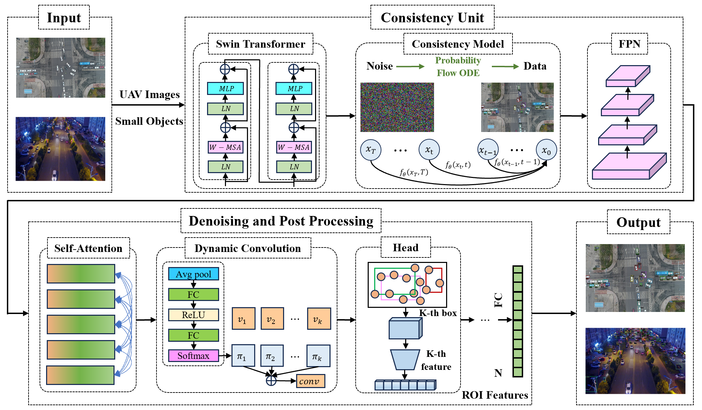
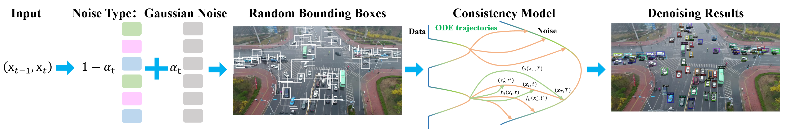

# CEOSOD: Consistency Model and Encoder-Decoder-based One-Step Small Object Detector for Unmanned Aerial Vehicles

## 1. Network Structure
### 1.1 The whold framework of the CEOSOD:

### 1.2 The Consistency Model of the CEOSOD:

## 2. Experimental results
<table border="1">
  <tr>
    <th>Method</th>
    <th>AP</th>
    <th>AP_50</th>
    <th>AP_S</th>
    <th>Download</th>
  </tr>
  <tr>
    <td>VisDrone-SwinBase</td>
    <td>32.7</td>
    <td>55.6</td>
    <td>23.6</td>
    <td><a href="https://drive.google.com/file/d/1lH21oidzf2PbP3IgQEBuACpMr7Y-9umy/view?usp=drive_link" download>model</a></td>
  </tr>
  <tr>
    <td>UAVDT-SwinBase</td>
    <td>19.4</td>
    <td>32.1</td>
    <td>16.3</td>
    <td><a href="https://drive.google.com/file/d/1qimluBul5EZyjeNTZDIz7IEPN3n7Gj8o/view?usp=drive_link" download>model</a></td>
  </tr>
</table>

## 3. Environmental initialization
1. Install anaconda, and create conda environment;
<pre>
conda create -n yourname python=3.8
</pre>
2. PyTorch ≥ 1.9.0 and torchvision that matches the PyTorch installation. You can install them together at [pytorch.org](https://pytorch.org/) to make sure of this.

3. Install Detectron2
<pre>
git clone https://github.com/facebookresearch/detectron2.git
python -m pip install -e detectron2
</pre>

## 4. Preparing data
<pre>
mkdir -p datasets/visdrone
mkdir -p datasets/uavdt
</pre>

You need to download the VisDrone dataset from its [official website](https://aiskyeye.com/)

You need to download the UAVDT dataset from its [official website](https://sites.google.com/view/grli-uavdt/%E9%A6%96%E9%A1%B5/)

## 5. Preparing pretrain models
<pre>
mkdir models
cd models
# ResNet-101
wget https://github.com/ShoufaChen/DiffusionDet/releases/download/v0.1/torchvision-R-101.pkl

# Swin-Base
wget https://github.com/ShoufaChen/DiffusionDet/releases/download/v0.1/swin_base_patch4_window7_224_22k.pkl
</pre>

## 6. Training
<pre>
python train_visdrone.py --num-gpus 4 \
  --config-file configs/ceosod.visdrone.swinbase.500boxes.yaml
</pre>

We provide several backbones including ResNet-50, ResNet-101, and Swin-Transformer for training and inference. You can change the backbone by choosing different yaml files in configs folder.

## 7. Evaluating
<pre>
python train_visdrone.py --num-gpus 4 \
  --config-file configs/ceosod.yourdataset.yourbakbone.yaml \
  --eval-only MODEL.WEIGHTS path/to/model.pth
</pre>

## 8. Inference Demo with Pre-trained Models

Inference Demo with Pre-trained Models
We provide a command line tool to run a simple demo following [Detectron2](https://github.com/facebookresearch/detectron2/tree/main/demo#detectron2-demo).

<pre>
python demo.py --config-file configs/ceosod.yourdataset.yourbakbone.yaml \
    --input image.jpg --opts MODEL.WEIGHTS path/to/model.pth
</pre>

You need to specify `MODEL.WEIGHTS` to a model from model zoo for evaluation.

For details of the command line arguments, see `demo.py -h` or look at its source code
to understand its behavior. Some common arguments are:
* To run __on your webcam__, replace `--input files` with `--webcam`.
* To run __on a video__, replace `--input files` with `--video-input video.mp4`.
* To run __on cpu__, add `MODEL.DEVICE cpu` after `--opts`.
* To save outputs to a directory (for images) or a file (for webcam or video), use `--output`.

## 9. Acknowledgement
A large part of the code is borrowed from DiffusionDet, Consistency models, and ConsistencyDet. Much thanks for their excellent works.
<pre>
@inproceedings{chen2023diffusiondet,
  title={Diffusiondet: Diffusion model for object detection},
  author={Chen, Shoufa and Sun, Peize and Song, Yibing and Luo, Ping},
  booktitle={Proceedings of the IEEE/CVF International Conference on Computer Vision},
  pages={19830--19843},
  year={2023}
}

@article{song2023consistency,
  title={Consistency models},
  author={Song, Yang and Dhariwal, Prafulla and Chen, Mark and Sutskever, Ilya},
  journal={arXiv preprint arXiv:2303.01469},
  year={2023}
}

@article{jiang2024consistencydet,
  title={ConsistencyDet: A Robust Object Detector with a Denoising Paradigm of Consistency Model},
  author={Jiang, Lifan and Wang, Zhihui and Wang, Changmiao and Li, Ming and Leng, Jiaxu and Wu, Xindong},
  journal={arXiv preprint arXiv:2404.07773},
  year={2024}
}

</pre>

